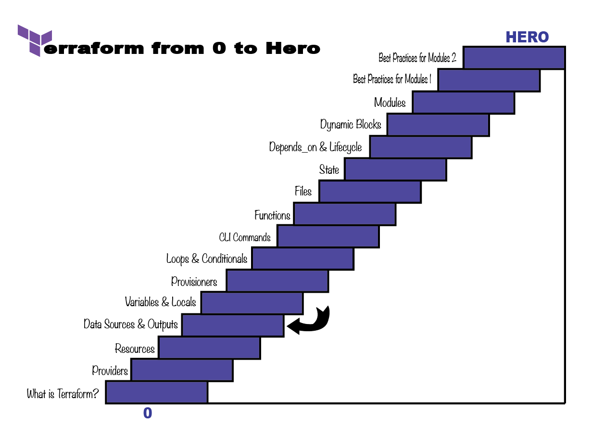

# Terraform with AWS

## Day 1: Terraform Basics
- Everything in Terraform is organized in **blocks**.  
- Overview of block types, terminology, Terraform file extensions.  
- Introduction to **variables**, **locals**, and **output blocks**.  

## Day 2: Providers
- Basics of **AWS** and **random** providers.  

## Day 3: S3 & Data Blocks
- Overview of **S3 remote backend**.  
- Introduction to **data blocks**.  

## Day 4: Core Concepts
- **Operators**, **data types**, **data structures**, **loops**, and **conditionals**.  

## Day 5: Built-in Functions
- Overview of Terraform **built-in functions**.  

## Day 6: Modules
- Introduction to **Terraform modules**.  

## Day 7: Dynamic Blocks (Incomplete)
- **Dynamic blocks** and **meta-arguments**.  

## Day 8: Provisioners & Workspaces (Incomplete)
- Basics of **provisioners** and **Terraform workspaces**.  

  

